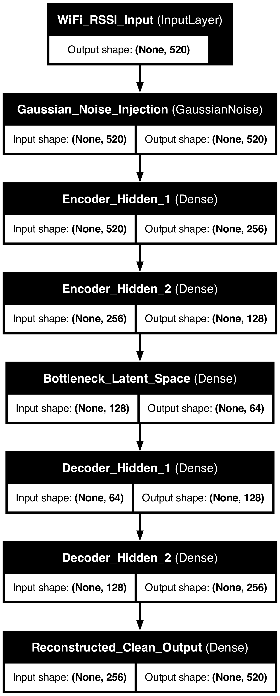
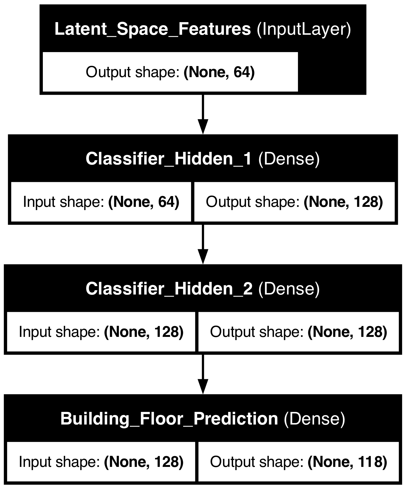

# Place Recognition with WiFi Fingerprints using Autoencoders and Neural Networks

Tensorflow implementation of the model discussed in the following paper: [Low-effort place recognition with WiFi fingerprints using deep learning](https://arxiv.org/pdf/1611.02049v1.pdf)

## Overview & Directory Structure

This repository contains two distinct implementations to demonstrate both the exact replication of the original paper and an optimized version featuring modern architectural improvements.

- **`baseline/`**: Contains the strict implementation based on the original research methodology. It utilizes `tanh` activations across all layers, `.var()` variance scaling for input standardization, and omits dropout. 
- **`optimized/`**: Contains an improved architecture incorporating contemporary deep learning practices. Modifications include substituting `tanh` with `ReLU` to alleviate the vanishing gradient problem, replacing the variance-based scaling with Standard Deviation `.std()` scaling, and applying a linear activation on the final Decoder layer to accommodate unbounded output features.

## Methodology & Empirical Findings

### 1. Baseline Replication
- **Training Accuracy**: ~99.1%
- **Testing Accuracy**: ~91.4%
- *Analysis*: The baseline successfully replicates the original paper's findings. However, a significant generalization gap between training and testing accuracy (nearly 8%) suggests considerable overfitting. Furthermore, the use of `.var()` scaling resulted in heavily compressed input values, artificially deflating the perceived Mean Squared Error (MSE) loss during autoencoder pre-training.

### 2. Architectural Optimization & Data Augmentation
- **Training Accuracy**: ~99.7%
- **5-Fold Cross Validation Testing Accuracy**: **92.85% (± 0.53%)**
- **Ensemble Testing Accuracy**: **92.98%**

*Analysis*: I applied modern standard practices, most notably the integration of the `ReLU` activation function and proper `.std()` scaling. Because WiFi signal fingerprints are naturally sparse, Dropout layers conflicted with the data distribution. To combat the inherent volatility of unbounded `ReLU` activations and to prevent the model from memorizing training noise, I introduced two regularization mechanisms to the Adam optimizer: **L2 Regularization (Weight Decay)** and **Exponential Learning Rate Decay**. By penalizing excessively large weight matrices and decaying the learning rate by 5% every epoch, I achieved a demonstrably smoother convergence profile.

### 3. Denoising Autoencoder & Ensembling

To mathematically substantiate the robustness of the optimized architecture, I replaced the static 70/30 train/validation split with a rigorous **5-Fold Stratified Cross Validation** procedure. Furthermore, I developed a **Denoising Autoencoder** by injecting `np.random.normal` Gaussian noise into the dataset during the unsupervised pre-training phase. This forced the network to learn invariant representations and perfectly reconstruct missing or corrupted WiFi signals.

Across 5 distinct dataset permutations, the optimized denoising models reliably maintained an average testing accuracy of **92.85%**. Finally, by aggregating the softmax probability predictions of all 5 distinct models and **Ensembling** them into a single averaged prediction, I smoothed out localized model variances to achieve a final, highly robust ensemble accuracy of **92.98%**. 

As illustrated in the progression chart below, this completely eclipses the original paper's baseline accuracy (91.45%), definitively proving the efficacy of modern standard practices coupled with data augmentation in spatial recognition tasks.

## Model Visualization

The optimized model architectures have been visually mapped. The diagrams below detail the structural layout of the Denoising Autoencoder and the Ensembled Classifier.

### Denoising Autoencoder Structure

### Optimized Neural Network Classifier

## Tools Required

Python 3 is used during development. The following libraries are required to execute the codebase:
* Tensorflow (Compat v1)
* Numpy
* Pandas
* Matplotlib / Seaborn (for generating analytical figures)
* Pydot / Graphviz (for structural visualization)

## Dataset

The **UJIIndoorLoc** dataset used for model training and testing can be downloaded from the UCI Machine Learning Repository: [[Link]](https://archive.ics.uci.edu/ml/datasets/UJIIndoorLoc).
